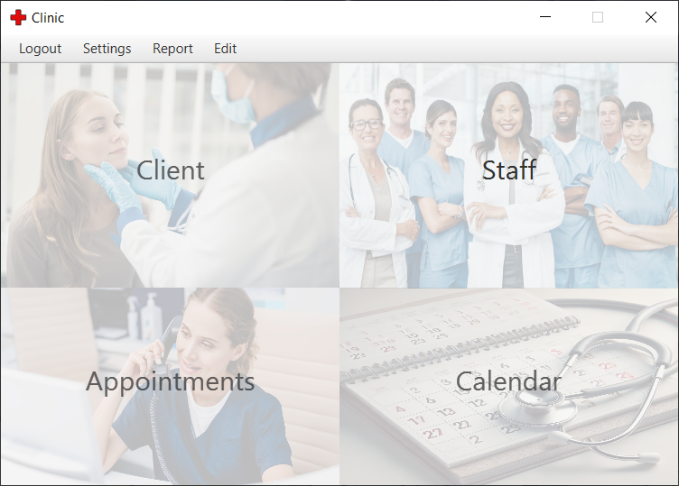
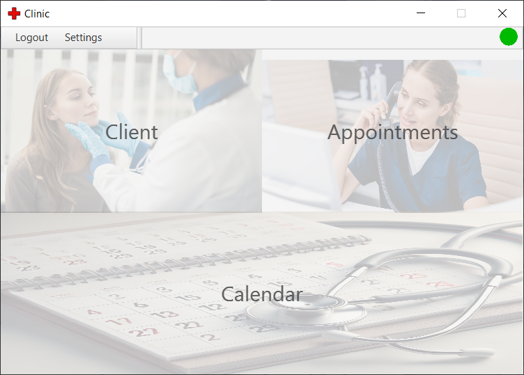
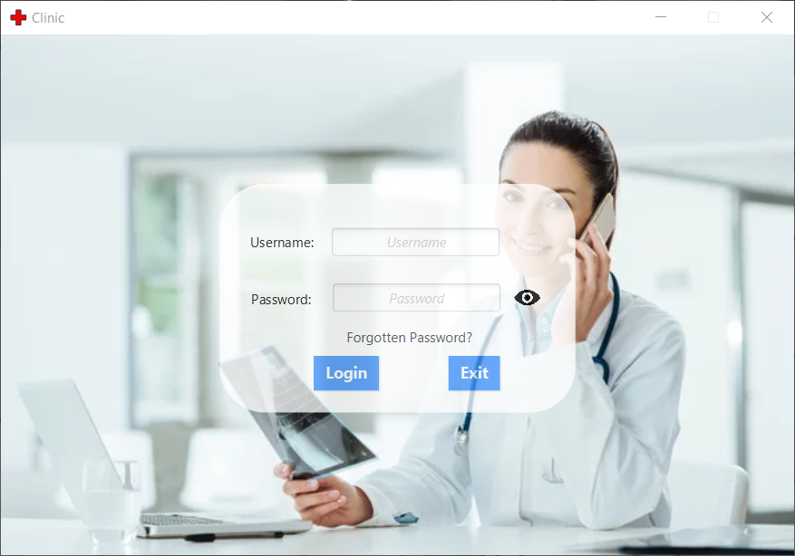
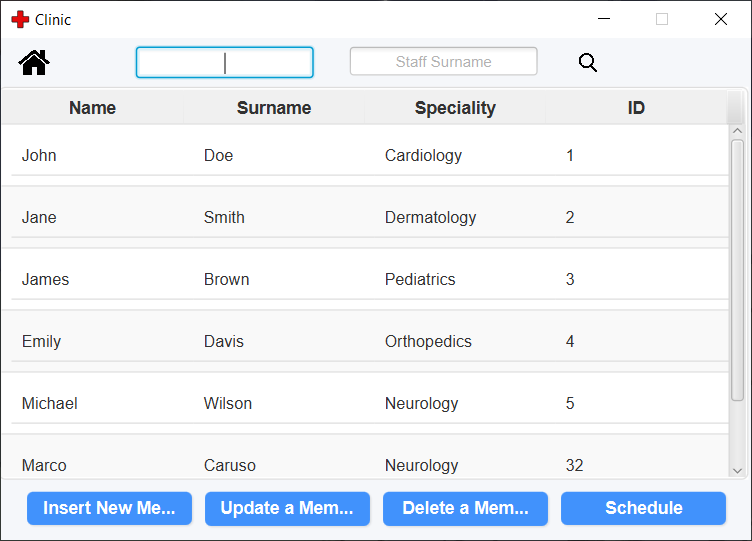
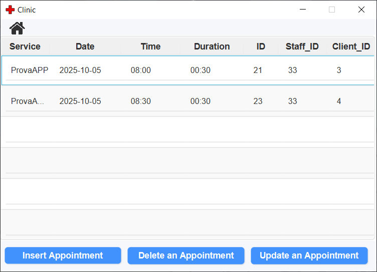
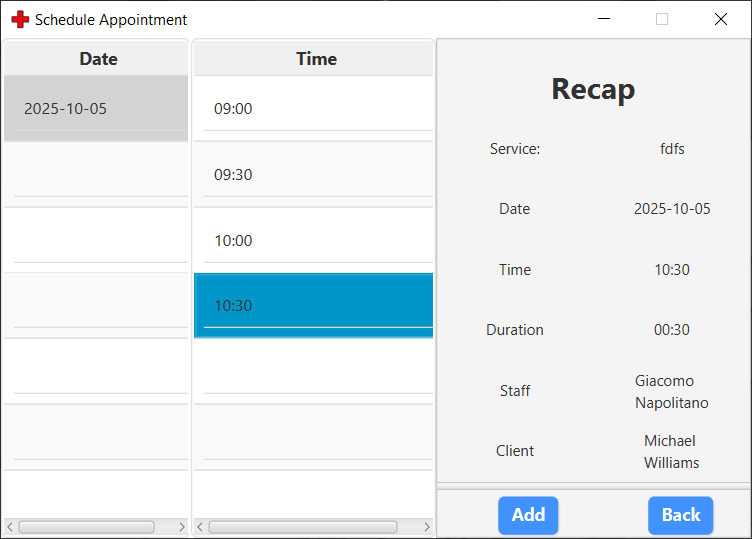

# 🗓️ Appointment_Scheduling_System

The **Appointment Scheduling System** is a desktop application developed in **Java** that allows clinics or salons to manage their appointments, clients, and staff efficiently.  
It provides features for booking, modifying, and viewing appointments through an intuitive **JavaFX** graphical interface.

# Video demo
The full demo video is available as a ZIP file in the `videos` folder:

[Download Demo Video](videos/ClinicDemo.zip)

> Note: You need to unzip the file to watch the video.

---

## Screeshot

There are some screenshots from this project: 

  
  

  
  

  
  

---

## 🧩 Technologies Used
- **Java SE 17+**
- **JavaFX** – graphical user interface (GUI)
- **JDBC (Java Database Connectivity)** – database interaction
- **MySQL** – relational database
- **DAO Pattern (Data Access Object)** – database abstraction layer
- **MVC Pattern (Model-View-Controller)** – software architecture

---

## 🧱 Project Architecture
The system follows the **Model-View-Controller (MVC)** architecture to ensure modularity, scalability, and maintainability.  

### **Model**
Contains the core entities of the domain:
- Client  
- Staff  
- Appointment  
- Service  

Each class defines attributes, constructors, getter/setter methods, and validation logic.  

### **DAO Layer**
Implements the **Data Access Object (DAO)** pattern to manage all database operations (CRUD) using **JDBC** with `PreparedStatement` to prevent SQL injection.  

### **View**
Developed using **JavaFX** with **FXML** files for layout:
- Dedicated controllers for each view  
- Styled with **CSS** for a clean and modern interface  

---

## ⚙️ Core Features
### 🔐 Authentication
- Secure staff login with hashed passwords  

### 👥 Client Management
- Add, view, update, and delete client records  
- View client appointment history  

### 👨‍⚕️ Staff Management
- Manage staff profiles, specialties, and working hours  

### 📅 Appointment Scheduling
- Book, edit, and cancel appointments  
- Display appointments in daily, weekly, and monthly calendar views  
- Filter by staff member, client, or service type  

### 🔔 Notifications & Reminders
- Automated reminders for clients (email/message simulation)  
- Notifications for staff regarding upcoming appointments  

### 📊 Reporting
- Generate appointment reports by period  
- View detailed client history and service statistics  

---

## 🧭 Development Methodology
Developed following **Agile/Scrum** principles:
- Sprint planning: weekly development iterations  
- Daily stand-ups: progress updates and issue tracking  
- Sprint review & retrospective: continuous improvement after each sprint  

---

## 👨‍💻 Authors
- **Marco Caruso**, MSc Student in Computer Engineering (LM-32)  
- **Federico Silvi**, MSc Student in Computer Engineering (LM-32)  
- **Giacomo Napolitano**, MSc Student in Computer Engineering (LM-32)
